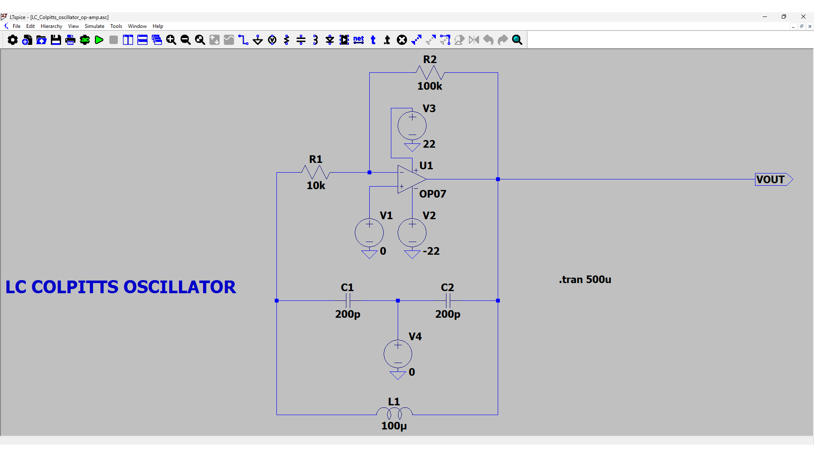
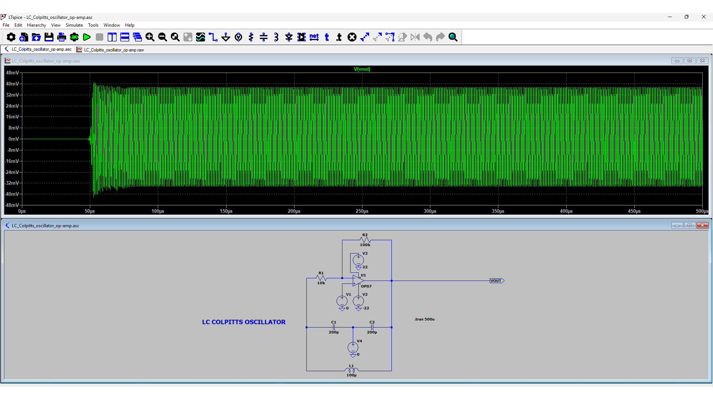
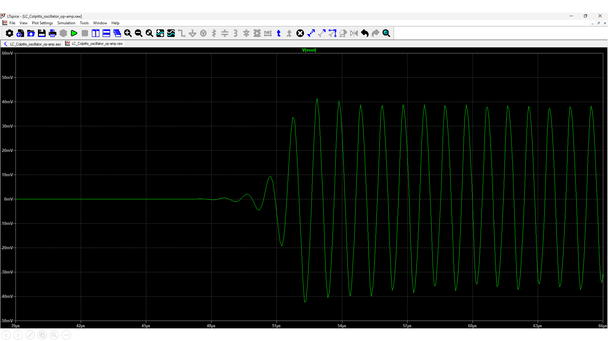

# LC COLPITTS OSCILLATOR

## Overview

This project involves designing an **LC Colpitts Oscillator** to generate sinusoidal waveforms using an operational amplifier and an LC feedback network. The oscillator leverages the phase-shift and resonance conditions of an LC tank circuit to produce stable, continuous sine waves. The primary objective is to analyze, simulate, and understand how component values influence the frequency and amplitude of oscillation.

## Table of Contents

- [Objective](#objective)  
- [System Block Diagram](#system-block-diagram)  
- [Detailed Circuit Description](#detailed-circuit-description)  
- [Mathematical Analysis and Component Selection](#mathematical-analysis-and-component-selection)  
- [Performance Highlights](#performance-highlights)  
- [Applications and Use Cases](#applications-and-use-cases)  
- [Conclusion](#conclusion)  
- [References](#references)

## Objective

- **Design a Colpitts Oscillator** to generate sustained sine wave signals using an LC tank circuit.
- **Analyze** the frequency of oscillation and phase shift using component values.
- **Simulate** the design and verify sinusoidal waveform output.
- **Understand** the role of transistor biasing and feedback for oscillation conditions.

## System Block Diagram

<strong>Figure 1 : LC Colpitts Oscillator Circuit</strong>

## Detailed Circuit Description

### Feedback Network (LC Tank)

- **Capacitors C1 and C2** form a **capacitive voltage divider**.
- **Inductor L** with C1 and C2 creates a **resonant LC tank circuit**.
- The feedback is taken from the **junction of C1 and C2** back to the **transistor base** to sustain oscillations.

### Active Device: Transistor Amplifier

- **NPN BJT** is configured in **common emitter** mode.
- Provides **necessary gain** and **inverts the phase**.
- Helps fulfill **Barkhausen Criterion** (loop gain ≥ 1 and phase shift = 0° or 360°).

### Biasing and Coupling Elements

- **Rc and Re** set the transistor's **DC operating point**.
- **Bypass capacitor Ce** offers low reactance path at oscillation frequency.
- **Base bias resistors** provide a stable Q-point.

## Mathematical Analysis and Frequency Calculation

- **The effective capacitance is**:

$$
C_{\text{eff}} = \frac{C_1 \cdot C_2}{C_1 + C_2}
$$

- **Frequency of Oscillation**:

 $$
f = \frac{1}{2\pi} \sqrt{ \frac{1}{L \cdot \left( \frac{C_1 \cdot C_2}{C_1 + C_2} \right) } }
$$

Given:

- $C_1 = C_2 = 200\,\mathrm{pF} = 200 \times 10^{-12}\,\mathrm{F}$
- $L = 100\,\mu\mathrm{H} = 100 \times 10^{-6}\,\mathrm{H}$

Substituting the values of C1 & C2, we get   

$$
C_{\text{eff}} = \frac{C_1 \cdot C_2}{C_1 + C_2} = \frac{200 \times 10^{-12} \cdot 200 \times 10^{-12}}{200 \times 10^{-12} + 200 \times 10^{-12}} = 100 \times 10^{-12} \,\text{F}
$$

Now, Let's calculate the frequency of Oscillation :

$$
f = \frac{1}{2\pi} \sqrt{ \frac{1}{L \cdot C_{\text{eff}}} } = \frac{1}{2\pi} \sqrt{ \frac{1}{100 \times 10^{-6} \cdot 100 \times 10^{-12}} }
$$

$$
f = \frac{1}{2\pi} \sqrt{ \frac{1}{10^{-14}} } = \frac{1}{2\pi} \cdot 10^7 \approx \frac{10^7}{6.2832} \approx 1.59 \times 10^6 \ \text{Hz}
$$

$$
f \approx 1.6\ \text{MHz}
$$

- Oscillation condition:

  - Loop gain ≥ 1  
  - Phase shift = 360° (amplifier gives 180°, tank circuit gives additional 180°)
 
## Output Waveform

- Zooming it to visualize the small initial oscillations

## Performance Highlights

- **Stable sinusoidal waveform** with desired frequency.
- Frequency controlled by **L, C1, and C2** values.
- **Amplitude limited** by non-linear behavior of the BJT (prevents overdrive).
- Low distortion and high signal purity depending on Q-factor.

## Applications and Use Cases

- **RF Signal Generators**
- **Local Oscillators** in radios and receivers
- **Sine Wave Generators** for testing analog systems
- **Function Generators** and **Analog Modulators**

## Conclusion

- **Colpitts oscillator** uses a simple LC configuration with a BJT to generate sustained sinusoidal signals.
- Proper feedback and biasing are essential for maintaining oscillation.
- Frequency is determined by reactive elements, making it tunable for RF and analog use.

## References
1. OP07 (Op-Amp) Datasheet : [OP07 Datasheet](OP07.PDF)
2. Boylestad, R. L., & Nashelsky, L. (Electronic Devices and Circuit Theory)
3. Sedra, A. S., & Smith, K. C. (Microelectronic Circuits)
